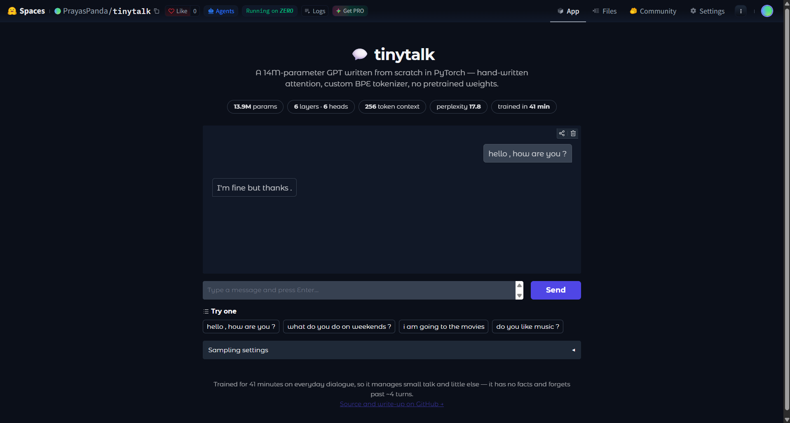

# tinytalk - a conversational LLM trained from scratch

A 14M parameter decoder-only transformer, written from first principles in PyTorch
and trained on the DailyDialog corpus. No pretrained weights, no `transformers`
library — the attention, the block, the training loop and the sampler are all here.

**[💬 Try it live](https://huggingface.co/spaces/PrayasPanda/tinytalk)** · validation perplexity **17.75** after 41 minutes on one T4

[](https://huggingface.co/spaces/PrayasPanda/tinytalk)

## What's implemented by hand

| Piece | File |
|---|---|
| Byte-level BPE tokenizer (8k vocab) | [tokenizer/train_tokenizer.py](tokenizer/train_tokenizer.py) |
| Causal multi-head self-attention | [model/attention.py](model/attention.py) |
| Pre-norm transformer block, GELU FFN | [model/layers.py](model/layers.py) |
| Full model, weight tying, top-k sampling | [model/transformer.py](model/transformer.py) |
| Training loop, cosine LR, AMP, resume | [train/train.py](train/train.py) |
| Perplexity evaluation | [eval/metrics.py](eval/metrics.py) |

## Architecture

```
6 layers · 6 heads · 384 embedding dim · 256 context · 8192 vocab
13.9M parameters · weight-tied embeddings · learned positional embeddings
```

## How it works

**A chatbot out of a next-token predictor.** The model has no notion of a
conversation; it only continues text. Training data is formatted as
`<|user|> ... <|bot|> ...`, so after enough examples the tokens following
`<|bot|>` are reliably a reply. At inference the prompt ends with a bare
`<|bot|>` and the completion *is* the response. The speaker tags are the entire
mechanism — no chat-specific architecture.

**The causal mask is what forces learning instead of copying.**
During training the whole sequence is in memory, answer included. Without a
mask the cheapest strategy is to read the next token off the input, which
drives training loss to zero and produces noise at inference. Scores for future
positions are set to `-inf` before the softmax, so they become exactly zero
afterwards ([attention.py](model/attention.py)). The payoff is that one forward
pass over a 256-token window yields 256 honest next-token predictions rather
than one.

**Scaling by `1/√head_dim`** keeps pre-softmax logits in a range where
gradients survive; without it the dot products grow with dimension, the softmax
saturates toward one-hot, and the layer stops learning.

**Weight tying** shares one matrix between the input embedding and the output
head — they are inverse maps between token ids and the residual stream. It
removes 3.1M parameters, about 22% of the model, at no measured cost.

**Pre-norm residuals** (`x + attn(ln(x))`) leave an unnormalised identity path
from input to loss, so gradients reach early layers directly. Post-norm needs
careful warmup to avoid diverging at this depth.

## Correctness checks

Two properties are cheap to assert and expensive to debug after the fact, so
both modules self-check when run directly:

```bash
python -m model.attention     # scrambles future positions, asserts the past is unchanged
python -m model.transformer   # asserts untrained loss ≈ ln(vocab_size) = 9.01
```

A broken causal mask does not look broken — loss drops faster and generation
degrades only at inference. The first check falsifies it in a second. The
second catches the same bug from the other direction: an untrained model should
be exactly as uncertain as uniform guessing, so a loss far below `ln(8192)`
means information is leaking. The observed loss at iteration 0 was **9.015**
against a theoretical 9.010.

## Setup

```bash
pip install -r requirements.txt
```

On an RTX 50-series GPU install PyTorch with CUDA 12.8 first, or it falls back to CPU:

```bash
pip install torch --index-url https://download.pytorch.org/whl/cu128
```

## Usage

```bash
# 1. Train the tokenizer and build data/processed/{train,val}.bin
python tokenizer/train_tokenizer.py

# 2. Smoke test the loop (50 steps, any machine)
python train/train.py --max-iters 50

# 3. Full training run
python train/train.py

# 4. Chat with it
python eval/generate.py

# 5. Measure it
python eval/metrics.py

# 6. Web demo
python app/app.py
```

### Training on Colab

Checkpoints are written every `eval_interval` steps and training resumes from
`latest.pt` automatically, so a disconnect costs at most one interval. Point the
checkpoint directory at Drive so they survive:

```python
from google.colab import drive; drive.mount('/content/drive')
!git clone <this-repo> && cd llm-chatbot && pip install -r requirements.txt
!python tokenizer/train_tokenizer.py
!python train/train.py --checkpoint-dir /content/drive/MyDrive/llm-chatbot/checkpoints
```

## Results

Trained for 6000 iterations on a single Colab T4.

| Metric | Value |
|---|---|
| Validation loss | 2.85 (best, iter 5250) |
| Perplexity | 17.75 |
| Training time | 41 minutes |
| Tokens seen | 1.48M train / 137k val |

```
iter    0 | train 9.015 | val 9.014
iter 1000 | train 3.417 | val 3.510
iter 3000 | train 2.491 | val 2.979
iter 5250 | train 1.945 | val 2.849   <- best
iter 5999 | train 1.879 | val 2.877
```

Sample exchange (`python eval/generate.py`):

```
you: hello , how are you ?
bot: I'm fine , thanks . We're going to the beach and I'm going to get a little late .
```

The second clause drifts, which is the expected failure mode at 256 tokens of
context and this much training data — it keeps producing fluent dialogue after
it has run out of anything to say.

## Notes and limitations

- Trained on ~1.5M tokens of everyday dialogue, so it holds short casual
  conversations and nothing more. It is a demonstration of the architecture and
  training pipeline, not a useful assistant.
- No instruction tuning or RLHF — this is pretraining only.
- Context is 256 tokens; the chat interface keeps the last 4 turns.
- The train/val gap widens steadily after ~iter 2000 (0.05 → 0.93 by the end),
  so this run is data-bound rather than capacity-bound. More dialogue data would
  help more than more layers; `best.pt` captures the val minimum at iter 5250.
